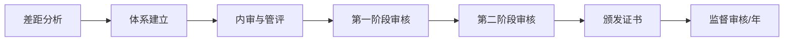

# ISO/IEC 27001

> 国际通用的信息安全管理体系（ISMS）标准，最新版本为ISO/IEC 27001:2022。

## ISMS框架

ISO 27001采用**PDCA（Plan-Do-Check-Act）** 持续改进模型：

| 阶段 | 活动 |
|------|------|
| Plan（策划） | 确定范围、制定安全方针、风险评估、选择控制措施 |
| Do（实施） | 实施控制措施、培训、文件化 |
| Check（检查） | 监控、测量、内审、管理评审 |
| Act（改进） | 纠正措施、预防措施、持续改进 |

## Annex A 控制域（2022版）

2022版将控制从14个域114项合并重组为**4个主题域93项控制**：

| 主题 | 控制项数 |
|------|---------|
| 组织控制（Organizational） | 37 |
| 人员控制（People） | 8 |
| 物理控制（Physical） | 14 |
| 技术控制（Technological） | 34 |

## 认证流程

- 第一阶段：文件审核 + 现场预审
- 第二阶段：全面审核，形成不符合项
- 证书有效期：**3年**，每年监督审核
- 认证机构需获得IAF认可

## ISO 27002的关系

- **ISO 27001**：规定ISMS要求，可认证
- **ISO 27002**：提供控制措施实施指南，不可单独认证
- 组织可选择Annex A中适用的控制，也可引入不在Annex A中的控制
- **SoA（适用性声明）**：文档化记录控制选择理由

## 整合建议

ISO 27001可与其他体系整合（ISO 9001、ISO 20000、ISO 27701），实现一体化管理。
