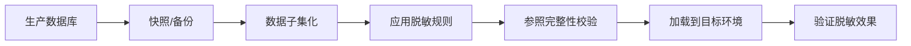

# 静态脱敏 (Static Data Masking, SDM)

## 定义与工作流程

**静态脱敏 (Static Data Masking, SDM)** 是指在数据离开生产环境之前，对敏感数据进行一次性、不可逆的脱敏处理，生成脱敏后的数据集供非生产环境使用。SDM 的核心原则是"源端脱敏"——在数据导出时即完成转换，确保敏感信息不会以明文形式离开安全边界。

SDM 的典型应用场景是将生产数据库克隆到开发、测试、培训或数据分析环境，在保留数据结构和统计特性的同时移除敏感内容。

## ETML 流程

SDM 的标准流程可概括为 **Extract-Transform-Mask-Load (ETML)**：

1. **Extract** — 从源数据库导出生产数据，通常通过快照或增量导出方式获取。
2. **Transform** — 应用数据转换规则，包括格式转换、编码转换、参照完整性维护等预处理。
3. **Mask** — 执行核心脱敏操作，包括替换、乱序、空值化、加噪等算法。
4. **Load** — 将脱敏后的数据加载到目标环境（开发、测试、培训环境）。

## SDM 架构模式

### 集中式架构

```
[生产数据库] → [ETL/SDM 引擎] → [脱敏数据集] → [目标环境]
                    ↑
              [脱敏规则库] (中央管理)
```

所有脱敏规则在中央引擎集中管理，适用于企业级统一管控场景。优点是一致性高、审计便捷，缺点是单点瓶颈。

### 嵌入式架构

```
[生产数据库] → [数据库内置脱敏插件] → [脱敏数据集] → [目标环境]
```

脱敏逻辑嵌入数据库本身（如 Oracle Data Masking Pack），利用数据库内置能力。优点是延迟低、无需额外组件，缺点是扩展性受限于数据库平台。

### Pipeline 集成架构

```
[生产数据库] → [CDC] → [Stream Processing] → [Mask Transform] → [Data Lake]
```

将脱敏嵌入数据流水线（如 Kafka + Flink），支持实时和近实时脱敏。适用于数据湖和实时分析场景。

## SDM 常见脱敏算法

| 算法 | 说明 | 示例 | 适用场景 |
|------|------|------|----------|
| 替换 (Substitution) | 用虚构但真实感的数据替换原始值 | 张三 → 李四 | 姓名、地址 |
| 乱序 (Shuffling) | 在同列内随机打乱值 | A行和B行的手机号互换 | 保持列分布 |
| 空值化 (Nulling) | 将敏感值替换为 NULL | 'ssn' → NULL | 非必需字段 |
| 加噪 (Noise Addition) | 添加随机噪声 | 薪资 50000 → 50123 | 数值列 |
| 加密 (Encryption) | 确定性加密保持一致替换 | email → AES( email ) | 可逆需求 |
| 令牌化 (Tokenization) | 用无意义令牌替换 | 卡号 → Token | 支付数据 |
| 掩码 (Masking) | 部分遮盖 | 手机号 138****1234 | 显示需求 |

### 确定性脱敏 vs 随机脱敏

**确定性脱敏**：同一原始值在不同表/行中脱敏为同一替代值，适合外键关联场景。**随机脱敏**：同一原始值每次脱敏结果不同，隐私保护更强但可能破坏数据关联。

## SDM vs Dynamic Masking (动态脱敏)

| 对比维度 | SDM (静态脱敏) | Dynamic Masking (动态脱敏) |
|----------|---------------|--------------------------|
| 处理时机 | 写入目标前一次性处理 | 查询时实时拦截改写 |
| 数据形态 | 物理上已脱敏的数据集 | 存储原始数据，返回时脱敏 |
| 性能影响 | 批处理开销，对在线系统无影响 | 每次查询有 5-15% 延迟开销 |
| 可逆性 | 不可逆（数据不可恢复） | 可逆（原始数据仍在存储中） |
| 适用场景 | 开发测试环境、数据分析 | 生产环境查询拦截、客服系统 |
| 数据副本 | 产生脱敏数据副本 | 无需额外存储 |
| 安全级别 | 高（数据离开生产即脱敏） | 中（依赖运行时拦截） |
| 合规适用 | PCI DSS、GDPR 数据导出 | 运行时访问控制 |

**选型建议**：SDM 适合需要将数据复制到非生产环境的场景；Dynamic Masking 适合生产环境中按用户权限动态控制数据可见性的场景。两者可组合使用形成纵深防御。

## SDM 实施关键考量

### 数据子集化
仅提取与测试/开发相关的数据子集，减少脱敏成本和存储开销。可采用条件筛选或行级采样策略。

### 参照完整性维护
确保脱敏后的外键关系保持一致，避免数据关联断裂。确定性脱敏是实现参照完整性的基础。

### 脱敏一致性
同一敏感值在不同表中必须脱敏为相同的替代值（确定性脱敏），确保跨表 JOIN 查询的正确性。

### 数据分布保持
优秀的 SDM 工具应保持脱敏后的数据分布特征（均值、方差、相关性）与原始数据近似，以保证测试有效性。

## 生产到非生产流程

SDM 的典型应用场景是从生产环境向非生产环境复制数据。推荐流程：



**数据刷新策略**：
- **全量刷新**：定期（如每周）完整复制和脱敏全部数据
- **增量刷新**：仅同步变更数据，适用于大数据量场景
- **按需刷新**：根据开发测试需求手动触发

## 工具对比

| 工具 | 部署模式 | 数据库支持 | 特色功能 |
|------|----------|------------|----------|
| Delphix | 虚拟化 + SDM | Oracle, SQL Server, MySQL, PostgreSQL | 数据虚拟化、自动化 pipeline、时间旅行 |
| IBM InfoSphere Optim | 企业级 | 大型机 + 分布式 | 数据子集化、合规报告、归档管理 |
| Oracle Data Masking | 集成 | Oracle 生态 | Oracle DB 原生集成、与 TDE 协同 |
| Informatica Persistent Data Masking | 独立/集成 | 广泛支持（50+ 数据源） | 算法丰富（300+）、调度灵活 |
| Microsoft SQL Server Data Masking | 插件 | SQL Server | SSMS 集成、脚本化 |
| IRI Cellar (FieldShield) | 独立 | 广泛支持 | 开源友好、高性能 |
| open-source: ARX Data Anonymization | 独立 | JDBC 兼容 | 支持 k-anonymity、l-diversity、DP |

## 自动化与集成

**最佳实践建议**：SDM 应作为 CI/CD pipeline 的一环自动化执行：

```yaml
# CI/CD Pipeline 中的 SDM 步骤示例
stages:
  - data_prep
  - mask_data
  - validate_mask
  - deploy_to_test

mask_data:
  stage: mask_data
  script:
    - sdm-cli extract --source $PROD_DB --subset "WHERE region='APAC'"
    - sdm-cli mask --config ./masking-rules.yaml
    - sdm-cli load --target $TEST_DB
  variables:
    MASKING_PROFILE: "development-tier"
```

## 行业应用场景

### 金融行业

| 场景 | 脱敏数据 | 核心需求 | 合规要求 |
|------|----------|----------|----------|
| 核心系统测试 | 客户姓名、身份证号、卡号、交易记录 | 保持参照完整性，支持全业务流测试 | PCI DSS 3.4, 《个人金融信息保护规范》 |
| 风控模型开发 | 交易流水、借贷记录、信用评分 | 保持数据分布特征，不影响模型准确性 | 《金融数据安全分级指南》 |
| 监管报送模拟 | 机构汇总报表、客户统计 | 保留统计特征，掩盖个体信息 | 《银行业金融机构数据治理指引》 |
| 外包开发测试 | 完整的业务数据集 | 不可逆脱敏，数据不可恢复 | 银保监会外包管理要求 |

**金融业典型脱敏策略**：身份证号采用 FPE 保持格式和校验位，卡号使用令牌化处理，手机号使用随机替换，地址使用泛化到街道级别。

### 医疗健康行业

| 场景 | 脱敏数据 | 核心需求 | 合规要求 |
|------|----------|----------|----------|
| 临床研究分析 | 电子病历、诊断记录、检查报告 | 保持疾病分布和治疗关联性 | HIPAA Privacy Rule, 《健康医疗大数据标准》 |
| 医疗 AI 训练 | 影像数据、病理报告 | 像素级脱敏（移除 DICOM 头信息） | 《个人信息保护法》敏感信息处理 |
| 公共卫生统计 | 区域内发病率、疫苗接种率 | 支持地理-流行病学分析 | 《传染病防治法》数据使用 |
| 药企临床试验 | 受试者数据、用药记录 | 支持数据二次分析和审评 | ICH-GCP, GDPR |

**医疗业典型脱敏策略**：HIPAA Safe Harbor 要求移除 18 种标识符；DICOM 影像需清除嵌入的患者姓名和 ID 标签；诊断描述使用语义泛化（如"糖尿病 2 型"→"内分泌疾病"）。

### 电信与互联网行业

| 场景 | 脱敏数据 | 核心需求 | 合规要求 |
|------|----------|----------|----------|
| 网络优化分析 | 用户位置数据、信令记录 | 支持聚合信令分析 | 《电信和互联网用户个人信息保护规定》 |
| 精准营销测试 | 用户画像、消费偏好 | 保持标签分布、支持 A/B 测试 | ePrivacy Directive |
| 反欺诈模型 | 通话记录、设备信息 | 保持异常模式的统计分布 | 《反电信网络诈骗法》 |
| 数据产品发布 | 匿名化后的行业报告 | 满足 k-anonymity 或差分隐私 | 数据安全法第 35 条 |

### 制造业与工业互联网

| 场景 | 脱敏数据 | 核心需求 | 合规要求 |
|------|----------|----------|----------|
| 产线 DevOps 测试 | 设备参数、工艺配方、MES 数据 | 保持产线数据的时序关联 | 商业秘密保护 |
| 供应链共享 | 供应商、采购价格、库存量 | 业务伙伴价格信息脱敏 | 《反不正当竞争法》 |
| 数字孪生仿真 | 设备运行数据、IoT 传感数据 | 保留数据分布用于仿真建模 | 企业信息安全策略 |

### 行业选型决策矩阵

```
决策因素:       金融    医疗    电信    制造
─────────────────────────────────────────
脱敏不可逆性:    中      高      低      中
参照完整性:      高      高      中      中
统计分布保持:    高      高      中      高
实时性要求:      中      低      高      低
合规审计要求:    高      极高    中      低
推荐架构:      集中式   集中式   Pipeline 嵌入式
```

## 参考标准
- GDPR Article 17 (Right to Erasure, 脱敏作为技术措施)
- PCI DSS Requirement 3.4 (掩码显示)
- NIST SP 800-53 SC-28 (静态数据保护)
- ISO 27001 A.10.1 (加密控制)
- HIPAA Privacy Rule (§164.514) — Safe Harbor / Expert Determination
- 《金融数据安全 数据安全分级指南》(JR/T 0197-2020)
