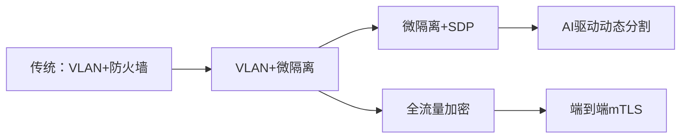

# 零信任成熟度模型

> 零信任成熟度模型（Zero Trust Maturity Model）帮助企业评估当前安全体系中的零信任能力水平，并规划分阶段的演进路线。CISA（美国网络安全和基础设施安全局）和各大安全厂商分别提出了各自的成熟度评估框架。

## CISA零信任成熟度模型

CISA在2023年发布了零信任成熟度模型，覆盖五大支柱和三个成熟度阶段。

### 五大支柱

```
┌─────────────────────────────────────────────────────────────┐
│                   CISA Zero Trust Maturity Model               │
├──────────┬──────────┬─────────────┬──────────┬──────────────┤
│ Identity  │  Device  │   Network    │  App/    │    Data     │
│  身份      │  设备    │    网络      │  Workload │    数据     │
│          │          │             │  应用/    │              │
│          │          │             │  工作负载  │              │
└──────────┴──────────┴─────────────┴──────────┴──────────────┘
```

### 三个成熟度阶段

| 成熟度 | 描述 | 特征 |
|-------|------|------|
| Traditional（传统） | 手动管理、静态策略、基于边界 | 依赖防火墙、VPN、手动身份管理 |
| Advanced（先进） | 部分自动化、动态策略、有限集成 | MFA、MDM、基本微隔离 |
| Optimal（最优） | 完全自动化、实时策略、全维度集成、AI驱动 | 持续认证、自适应策略、AI安全分析 |

## 按支柱的成熟度评估

### 1. Identity（身份）

| 能力 | Traditional | Advanced | Optimal |
|------|-----------|---------|---------|
| 目录服务 | Active Directory本地部署 | 混合AD + 云目录 | 云原生目录，无本地依赖 |
| 认证 | 仅用户名/密码 | MFA（某些应用） | 密码less（FIDO2/WebAuthn），连续认证 |
| 授权 | 静态RBAC角色 | 动态RBAC + ABAC | 实时风险评分，自适应授权 |
| 身份生命周期 | 手动创建/删除 | SCIM自动同步 | 全自动化身份生命周期管理 |
| 特权管理 | 静态管理员账户 | JIT特权访问管理 | 零长期特权，实时审批 |

**评估指标示例**：

```yaml
identity_maturity_assessment:
  pillar: Identity
  current_level: Advanced
  
  scores:
    authentication:
      - mfa_coverage: 75%    # 75%的应用已启用MFA
      - passwordless: 10%     # 10%的用户使用无密码认证
      
    lifecycle:
      - auto_provisioning: true
      - auto_deprovisioning: true
      - scim_integration: 60% # 60%的应用支持SCIM
      
    privileged_access:
      - jit_enabled: true
      - permanent_admin: 20    # 仍有20个永久管理员
      
  gap_analysis:
    - priority: HIGH
      gap: "未覆盖MFA的应用（剩余25%）"
      recommendation: "对剩余应用启用MFA，使用条件访问策略强制"
    - priority: MEDIUM
      gap: "密码less覆盖率低"
      recommendation: "优先对高管和IT管理员启用FIDO2"
```

### 2. Device（设备）

| 能力 | Traditional | Advanced | Optimal |
|------|-----------|---------|---------|
| 设备清单 | 手动登记 | MDM/UEM自动注册 | 实时设备状态同步 |
| 合规检查 | 无自动检查 | 登入时检查合规 | 持续合规监控 |
| 设备信任 | 仅检查是否公司设备 | 检查补丁等级、加密状态 | 硬件可信（TPM测量启动 + Remote Attestation） |
| 隔离机制 | 手动隔离 | 自动隔离不合规设备 | 自动隔离+修复，恢复后自动解除 |

**设备合规策略示例**：

```python
def device_compliance_check(device):
    """设备合规检查 - Optimal级别的连续合规"""
    checks = {
        "managed": device.mdm_enrolled,
        "os_updated": device.os_version >= MIN_OS_VERSION[device.platform],
        "encryption": device.disk_encryption_enabled,
        "firewall": device.firewall_active,
        "antivirus": device.av_active and device.av_signatures_updated,
        "screen_lock": device.screen_lock_seconds <= 300,
        "no_jailbreak": not device.jailbroken_or_rooted,
        "attested_boot": device.tpm_measured_boot_integrity,
    }
    
    compliance_score = sum(checks.values()) / len(checks)
    
    if compliance_score >= 0.9:
        return "COMPLIANT"
    elif compliance_score >= 0.7:
        return "COMPLIANT_LIMITED"  # 有限访问
    else:
        return "NON_COMPLIANT"  # 拒绝访问 + 自动隔离
```

### 3. Network（网络）

| 能力 | Traditional | Advanced | Optimal |
|------|-----------|---------|---------|
| 分段 | VLAN分段 | 微隔离（工作负载级别） | AI驱动的动态分段 |
| 访问方式 | VPN集中接入 | SDP/ZTNA | 无VPN，纯ZTNA |
| 加密 | 仅外部流量加密 | 内部东西向流量加密 | 全部流量端到端加密 |
| 可见性 | 边界流量监控 | 全流量可视化 | 实时流量分析和异常检测 |
| 策略依据 | 基于IP | 基于身份 | 基于身份+设备+数据分类+实时风险 |

**网络成熟度演进路线**：



### 4. Application/Workload（应用/工作负载）

| 能力 | Traditional | Advanced | Optimal |
|------|-----------|---------|---------|
| 访问控制 | 网络ACL + 防火墙规则 | 应用层代理 | 细粒度API级控制 |
| 应用生命周期 | 手动配置 | CI/CD集成安全扫描 | 自动化安全门禁 |
| 应用认证 | 内嵌在应用中 | 外部IdP联合认证 | 服务网格mTLS自动认证 |
| 运行时保护 | 无 | WAF + RASP | 应用自我保护和自适应防护 |

```yaml
# Kubernetes服务网格安全策略 - Optimal级别
apiVersion: security.istio.io/v1beta1
kind: AuthorizationPolicy
metadata:
  name: payment-api-authz
  namespace: payment
spec:
  selector:
    matchLabels:
      app: payment-api
  action: ALLOW
  rules:
  - from:
    - source:
        principals: ["cluster.local/ns/frontend/sa/web-gateway"]
        namespaces: ["frontend"]
    to:
    - operation:
        methods: ["POST", "GET"]
        paths: ["/api/v1/payments/*"]
    when:
    - key: request.headers[Content-Type]
      values: ["application/json"]
    - key: source.principal
      values: ["*@company.com"]
```

### 5. Data（数据）

| 能力 | Traditional | Advanced | Optimal |
|------|-----------|---------|---------|
| 数据分类 | 手动分类 | 自动化敏感数据发现 | 机器学习自动分类 |
| 加密 | 仅传输加密 | 传输+静态加密 | 端到端加密（E2EE）+ 同态加密 |
| DLP | 边界DLP | 端点+云端DLP | 全渠道DLP（端+云+邮件+终端） |
| 访问控制 | 基于网络位置 | 基于身份+角色 | 数据级权限（cell-level） |

## 成熟度评估工具

### 自评矩阵

使用以下评分表进行零信任成熟度自评（每项1-5分）：

```python
assessment_categories = {
    "Identity": {
        "mfa_coverage": 4,           # 1-5
        "lifecycle_automation": 3,
        "privileged_access": 3,
        "federation_integration": 4,
    },
    "Device": {
        "mdm_coverage": 4,
        "compliance_checking": 3,
        "continuous_monitoring": 2,
        "automated_quarantine": 2,
    },
    "Network": {
        "micro_segmentation": 2,
        "ztna_coverage": 3,
        "encryption_internal": 2,
        "traffic_visibility": 3,
    },
    "Application": {
        "api_level_control": 3,
        "security_in_pipeline": 3,
        "runtime_protection": 2,
        "service_mesh": 1,
    },
    "Data": {
        "classification_automation": 2,
        "dlp_coverage": 3,
        "data_level_access": 2,
        "audit_capability": 3,
    }
}

def calculate_maturity(assessment):
    """计算总体成熟度"""
    pillars = {}
    overall_score = 0
    total_categories = 0
    
    for pillar, items in assessment.items():
        pillar_score = sum(items.values()) / len(items)
        pillars[pillar] = round(pillar_score, 1)
        overall_score += pillar_score
        total_categories += len(items)
    
    overall = round(overall_score / total_categories, 1)
    return pillars, overall

# 模拟评估
pillars, overall = calculate_maturity(assessment_categories)
print(f"各支柱分数: {pillars}")
print(f"总体成熟度: {overall}/5.0")
# 评分参考：0-1.9=传统, 2.0-3.4=先进, 3.5-5.0=最优
```

## 主要厂商的成熟度框架

### Forrester Zero Trust Maturity Model

Forrester的模型分为七个支柱：

| 支柱 | 核心问题 |
|------|---------|
| 网络安全（Network Security） | 是否已实现微分段和加密？ |
| 数据安全（Data Security） | 数据是否已分类并实施了DLP？ |
| 终端安全（Endpoint Security） | 是否对所有设备进行持续监控？ |
| 身份安全（Identity Security） | 是否启用了MFA和JIT管理？ |
| 应用安全（Application Security） | 是否对应用进行了安全加固？ |
| 分析与可视化（Analytics & Visibility） | 是否具备全流量可视化能力？ |
| 自动化与编排（Automation & Orchestration） | 安全响应是否自动化？ |

### Palo Alto Networks Zero Trust Assessment

```yaml
# Palo Alto零信任评估框架（简化版）
assessment_areas:
  user_group:
    - All users authenticated
    - MFA for privileged users
    - Conditional access policies
    
  device_group:
    - All devices inventory tracked
    - Device health verified
    - Automated quarantine capability
    
  application_group:
    - Application discovery complete
    - App dependency mapping
    - App segmentation in place
    
  infrastructure_group:
    - Traffic encryption
    - Micro-segmentation
    - Security automation
```

## 零信任成熟度提升路线图

### 短期（0-6个月）

```
优先级：身份和设备的可视化和基础控制
├── 建立全量设备清单
├── 所有应用实施MFA
├── 启用SSO和联合身份
├── 部署MDM/UEM
└── 基础流量可视化
```

### 中期（6-18个月）

```
优先级：网络分段和应用安全加固
├── 实施微隔离（逐步推进）
├── 部署ZTNA/SDP替代VPN
├── 内部流量加密（mTLS）
├── CI/CD安全门禁
└── 敏感数据自动分类
```

### 长期（18-36个月）

```
优先级：自动化和自适应安全
├── 全流量加密和端到端mTLS
├── AI驱动的异常检测和自适应策略
├── 完全自动化的安全运维
├── 数据级（Cell-level）访问控制
└── 零信任架构全面覆盖
```

## 总结

零信任成熟度模型为企业提供了一条循序渐进、可量化的零信任演进路径。CISA的五支柱框架帮助组织系统性地评估和提升零信任能力，覆盖从传统边界模型到最优自动化安全模型的完整演进路线。核心建议是：**从身份和设备入手，先实现基础控制，再逐步扩展到网络、应用和数据层面**。
