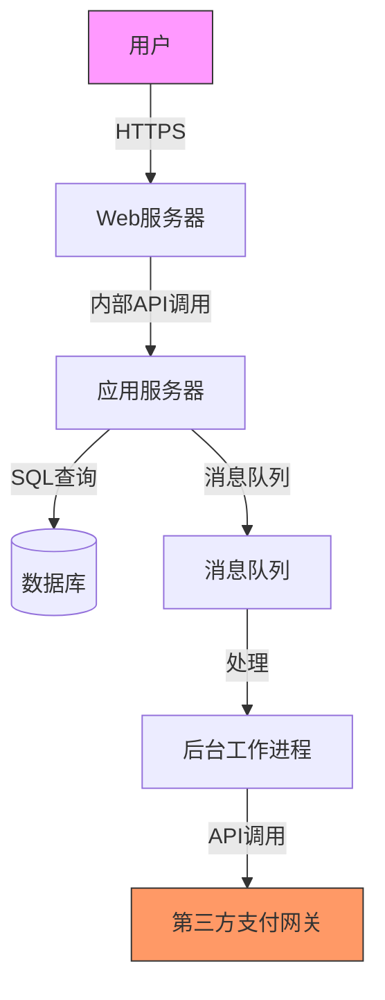

# SDL安全开发生命周期

> 安全开发生命周期（Security Development Lifecycle, SDL）是将安全实践系统性地融入软件开发生命周期的方法论。Microsoft SDL是最成熟的框架之一，本文将介绍SDL各阶段的安全活动和威胁建模方法。

## Microsoft SDL各阶段

Microsoft SDL将安全活动嵌入到传统软件开发的每个阶段：

```
┌─────────────────────────────────────────────────────────┐
│                  Microsoft SDL 流程                        │
├──────────┬──────────┬──────────┬──────────┬─────────────┤
│  培训     │  需求     │  设计     │  实现     │  验证       │
├──────────┼──────────┼──────────┼──────────┼─────────────┤
│ 安全基础   │ 安全需求  │ 威胁建模  │ 安全编码  │ 动态分析    │
│ 隐私意识   │ 隐私需求  │ 攻击面  │ 禁用函数  │ 模糊测试    │
│          │          │  减少    │ 静态分析  │ 攻击面审查  │
├──────────┴──────────┴──────────┴──────────┼─────────────┤
│         发布           │               响应             │
├───────────────────────┼───────────────────────────────┤
│ 事件响应计划           │ 执行事件响应计划                 │
│ 最终安全审查（FSR）    │ 安全更新和补丁                   │
│ 软件发布归档           │ 事后分析和改进                   │
└───────────────────────┴───────────────────────────────┘
```

### 阶段1：培训

所有开发人员、测试人员、项目经理需要接受安全培训：

| 培训主题 | 目标受众 | 内容 |
|---------|---------|------|
| 安全编码基础 | 所有开发人员 | OWASP Top 10、常见漏洞模式 |
| 威胁建模 | 架构师、高级开发 | STRIDE分类、威胁建模工具使用 |
| 隐私工程 | 产品经理 | GDPR、数据最小化原则 |
| 安全测试 | QA工程师 | 模糊测试、安全扫描 |

### 阶段2：需求定义

在需求阶段确定安全需求和隐私需求：

```yaml
# 安全需求文档示例
project: payment-platform-v2
security_requirements:
  authentication:
    - requirement: "所有API端点必须支持OAuth 2.0"
    - requirement: "敏感操作需要MFA验证"
    - requirement: "会话令牌有效期不超过30分钟"
  
  authorization:
    - requirement: "实施基于角色的访问控制（RBAC）"
    - requirement: "所有跨服务调用必须使用mTLS"
  
  data_protection:
    - requirement: "静态数据加密（AES-256）"
    - requirement: "传输层加密（TLS 1.3）"
    - requirement: "敏感数据字段级加密处理"
  
  logging:
    - requirement: "所有认证事件必须记录审计日志"
    - requirement: "日志中不得包含PII或敏感数据"
    - requirement: "日志保留至少180天"

compliance_requirements:
  - pci_dss_v4
  - gdpr
  - sox
```

### 阶段3：设计 —— 威胁建模

威胁建模是SDL中最关键的设计活动。使用STRIDE分类法对每个功能元素进行分析：

#### STRIDE威胁分类

| 威胁类型 | 违反的安全属性 | 定义 | 示例 |
|---------|--------------|------|------|
| Spoofing（欺骗） | 认证 | 冒充他人身份 | 伪造JWT令牌、会话劫持 |
| Tampering（篡改） | 完整性 | 未经授权修改数据 | 修改传输中的请求参数 |
| Repudiation（抵赖） | 不可否认性 | 否认已执行的操作 | 缺乏审计日志导致无法追溯 |
| Information Disclosure（信息泄露） | 机密性 | 信息暴露给未授权者 | SQL注入泄露数据库内容 |
| Denial of Service（拒绝服务） | 可用性 | 系统资源耗尽 | 大量请求耗尽API配额 |
| Elevation of Privilege（权限提升） | 授权 | 获取超出权限的操作能力 | 普通用户访问管理接口 |

```python
# 威胁建模自动化示例
threat_model = {
    "component": "Payment API Gateway",
    "data_flow": "User -> Gateway -> Payment Service -> Database",
    
    "threats": [
        {
            "id": "T001",
            "type": "Spoofing",
            "description": "攻击者伪造JWT令牌访问支付接口",
            "mitigation": "实施JWT签名验证，使用RS256算法",
            "priority": "Critical"
        },
        {
            "id": "T002",
            "type": "Tampering",
            "description": "中间人攻击修改支付请求参数",
            "mitigation": "强制使用TLS 1.3，实施请求签名",
            "priority": "High"
        },
        {
            "id": "T003",
            "type": "Information Disclosure",
            "description": "错误信息暴露数据库结构",
            "mitigation": "自定义错误处理，不暴露堆栈信息",
            "priority": "Medium"
        },
        {
            "id": "T004",
            "type": "Denial of Service",
            "description": "大量请求导致支付接口不可用",
            "mitigation": "实施速率限制、配额管理",
            "priority": "High"
        }
    ]
}
```

#### 数据流图（DFD）示例



**每个数据流需要分析的威胁**：

```
数据流：Web -> App（内部API调用）
├── Spoofing：API调用方是否经过身份验证？ → mTLS
├── Tampering：请求是否被篡改？ → 请求签名
├── Repudiation：是否有调用日志？ → 审计日志
├── Info Disclosure：是否包含敏感参数？ → 参数加密
├── DoS：调用量是否过大？ → 限流
└── EoP：调用方是否有权限？ → RBAC
```

#### 攻击面减少

在设计阶段识别并减少攻击面：

```yaml
attack_surface_reduction:
  - action: "禁用不需要的功能"
    examples:
      - "关闭调试/开发端点"
      - "移除未使用的API路由"
      - "禁用不安全的HTTP方法（PUT/DELETE如果不是必需）"
  
  - action: "最小化用户输入"
    examples:
      - "使用白名单而非黑名单验证"
      - "预定义输入格式（如日期选择器而非自由文本框）"
  
  - action: "最小化权限"
    examples:
      - "数据库使用最小权限账户"
      - "服务账户只授予所需的最小权限"
  
  - action: "减少暴露端口"
    examples:
      - "只开放必要的服务端口"
      - "管理接口绑定到管理网络而非公网"
```

### 阶段4：实现 —— 安全编码

#### 禁用函数列表

```c
// Windows开发禁用函数
// strcpy -> strcpy_s
// strcat -> strcat_s  
// sprintf -> sprintf_s
// gets -> gets_s
// scanf -> scanf_s

// 编译时使用SDL检查
// MSVC编译选项：/sdl

// 使用Guardian检查（.NET）
// dotnet add package Microsoft.CodeAnalysis.FxCopAnalyzers

// GitHub CodeQL自动检测危险函数
```

```python
# Python安全编码示例
import secrets
import hashlib
import hmac
from datetime import datetime, timedelta

class SecurePaymentService:
    def __init__(self):
        pass
    
    def generate_api_key(self):
        """使用secrets生成安全的API密钥"""
        return secrets.token_urlsafe(32)
    
    def hash_password(self, password: str, salt: bytes = None):
        """安全密码哈希（PBKDF2 + SHA256）"""
        if salt is None:
            salt = secrets.token_bytes(16)
        
        # 100000次迭代，增加暴力破解成本
        hashed = hashlib.pbkdf2_hmac(
            'sha256',
            password.encode('utf-8'),
            salt,
            100000
        )
        return salt + hashed  # 前16字节为salt
    
    def verify_password(self, stored_hash: bytes, password: str):
        """使用恒定时间比较验证密码"""
        salt = stored_hash[:16]
        expected_hash = stored_hash[16:]
        computed_hash = hashlib.pbkdf2_hmac(
            'sha256',
            password.encode('utf-8'),
            salt,
            100000
        )
        return hmac.compare_digest(expected_hash, computed_hash)
    
    def validate_input(self, user_input: str):
        """白名单输入验证"""
        import re
        # 只允许字母、数字和特定符号
        pattern = r'^[a-zA-Z0-9_\-.@]+$'
        if not re.match(pattern, user_input):
            raise ValueError("Invalid input characters")
        return user_input
```

#### 静态分析集成

```yaml
# GitHub Action: CodeQL分析
name: "CodeQL"
on:
  push:
    branches: [main]
  pull_request:
    branches: [main]

jobs:
  analyze:
    name: Analyze
    runs-on: ubuntu-latest
    permissions:
      security-events: write
      actions: read
      contents: read

    strategy:
      fail-fast: false
      matrix:
        language: ['python', 'javascript']

    steps:
    - name: Checkout repository
      uses: actions/checkout@v4

    - name: Initialize CodeQL
      uses: github/codeql-action/init@v3
      with:
        languages: ${{ matrix.language }}

    - name: Autobuild
      uses: github/codeql-action/autobuild@v3

    - name: Perform CodeQL Analysis
      uses: github/codeql-action/analyze@v3
```

### 阶段5：验证

```bash
# 动态分析和模糊测试
# 使用.NET的SharpFuzz进行模糊测试
dotnet add package SharpFuzz
dotnet fuzz Sanitizer.dll

# Web应用动态扫描
zap-cli quick-scan --self-contained \
  --api-key $ZAP_API_KEY \
  -s xss,sqli,csrf \
  https://staging-app.company.com

# 攻击面验证
nmap -sV -p1-65535 staging-app.company.com
```

### 阶段6：发布 —— 最终安全审查（FSR）

FSR检查清单：

```yaml
final_security_review:
  threat_model:
    - status: completed
    - reviewer: "Security Architect"
  
  code_review:
    - static_analysis_cleared: true
    - manual_review_completed: true
    - open_findings: 0
  
  testing:
    - dynamic_scan_cleared: true
    - fuzz_testing_cleared: true
    - penetration_test_cleared: true
  
  dependencies:
    - sca_scan_cleared: true
    - no_critical_vulnerabilities: true
  
  release:
    - incident_response_plan_ready: true
    - security_contacts_defined: true
    - signing_certificates_in_place: true
```

## OWASP ASVS安全需求

OWASP Application Security Verification Standard（ASVS）为Web应用提供了分等级的安全验证标准：

| 等级 | 目标 | 适用范围 |
|------|------|---------|
| ASVS Level 1 | 基础安全控制 | 所有应用 |
| ASVS Level 2 | 敏感数据保护 | 处理敏感数据的应用 |
| ASVS Level 3 | 高安全防护 | 金融、医疗、军事等高安全应用 |

```yaml
# ASVS Level 2 验证要求示例（认证部分）
asvs_v2_authentication:
  V2.1: "密码安全"
  - 2.1.1: "所有密码至少12个字符"
  - 2.1.2: "不存在常见密码（如password123）"
  - 2.1.3: "密码存储使用自适应哈希函数（Argon2/scrypt/bcrypt）"
  - 2.1.4: "密码更换周期不超过90天"
  
  V2.2: "多因素认证"
  - 2.2.1: "所有管理功能需要MFA"
  - 2.2.2: "敏感API调用需要MFA"
  - 2.2.3: "支持TOTP或WebAuthn"
```

## 微软SDL的实际案例

以Microsoft本身的开发流程为例：

```yaml
# Microsoft Office 365 SDL实践
sdl_practices:
  training:
    - "所有开发人员必须完成Security Development Training"
    - "每年强制参加安全意识培训"
  
  tools:
    - "Visual Studio内置的Code Analysis"
    - "Microsoft Threat Modeling Tool"
    - "Bing (BinSkim) 二进制分析"
    - "SDL regkey scanner"
    - "MinFuzz模糊测试工具"
  
  gates:
    - "SAST扫描零严重发现才能合并PR"
    - "威胁建模必须在设计阶段完成"
    - "FSR（最终安全审查）是发布的必要条件"
  
  metrics:
    - "每个版本的漏洞密度"
    - "从发现到修复的平均时间"
    - "威胁建模覆盖率"
```

## 总结

SDL通过将安全活动嵌入到软件开发的每个阶段，系统性地减少应用漏洞。Microsoft SDL提供了从培训、需求、设计到发布和响应的完整框架，其中威胁建模是最具价值的活动之一。结合OWASP ASVS验证标准，团队可以建立可量化的安全质量标准。
